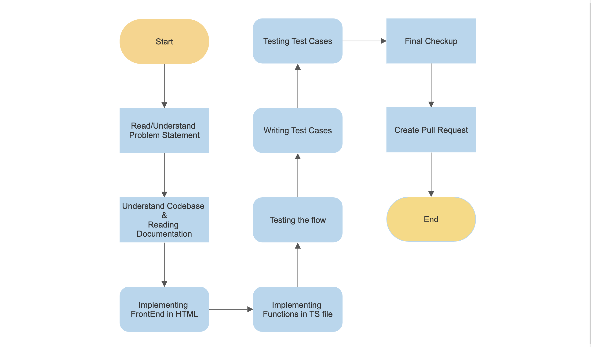
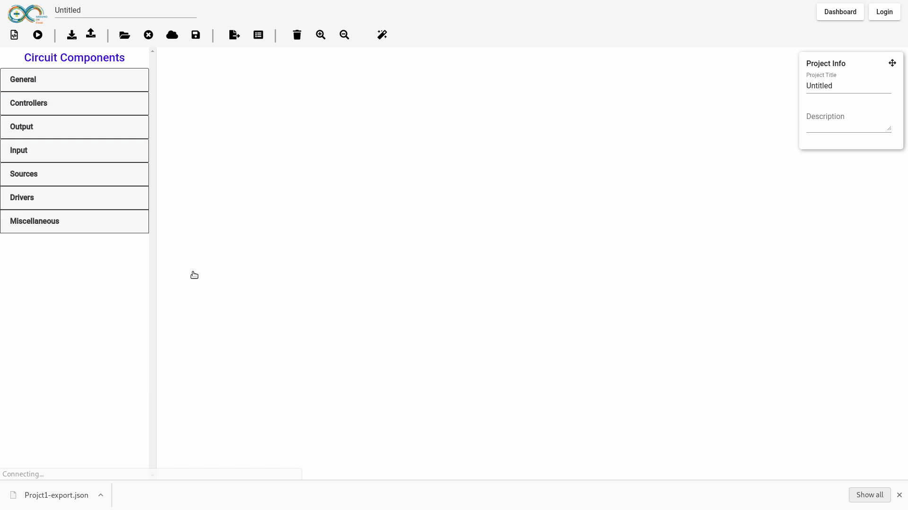

# FOSSEE Summer Fellowship 2021
## TASK 9:Import and export project
Currently, an authenticated user can save the circuit on the cloud. However, there should be a facility for a user to export the circuit in some format (say json) and import the circuit into the system as and when needed.
### How did you approach the problem?
I started by reading the problem statement. The moment i read it, i understood what things i may require to implement it, which turned out be json object which may have whole information about the user's progress on website, and then to read the json while importing i might require some kind of flow which will load everything present in json format. After this i started understanding a little bit about the major functions used, Angular Route i might work majorly on and data structure i might need. I ended up determining all these things through little bit of research on documentation of project and then searched in project itself.
After searching a bit i found that we are already saving a JSON object in indexedDB of browser, and then fetching it to load project from there. This helped me to better understand the flow by revisiting those functions used in there. So all this gave me fine idea about how to solve the problem. So solution i came up was i will generate an object containing all data about the Schematic on website, then save its blob into a file and download it. And if we want to import a json, then function will read the file's blob and process it in a function after converting into an object again from file blob.

### What steps you took to solve?
Talking about the steps i followed, Firstly i started by reading and understanding the Task 9. Then i opened the codebase and tried to understand it with the help documentation given about the project, mentioned in gihub repo. After which i forked the project on my account and cloned it on my system.
For whole coding process i divided it into two parts, frontend and frontend logic part. According to which i first implemented the html buttons to interact with, and then in next step implemented the frontend's logic in TS files of project. After whole coding process i tested the flow locally on my system, did some improvements as suggested by project leads followed by writing test cases for my functions. I used unit tests approach to implement tests in Angular's inbuilt testing framework.
After doing the final checkup of all files and doing linting of project, i created the PR of my branch against develop branch in upstream, which got merged after a failed build due to linting issue. I have also attached a flow chart explaining whole process graphically below.

### Any new package/technology that you used?
No, i did not use any new package or technology.

### Indicate which files were changed heavily
Here are the files which were changed:
- ArduinoFrontend/src/app/Libs/Workspace.ts - Added logic for exporting to JSON
- ArduinoFrontend/src/app/app.module.ts - Added new component Declarations here
- ArduinoFrontend/src/app/export-jsondialog/export-jsondialog.component.css - CSS of dialog here
- ArduinoFrontend/src/app/export-jsondialog/export-jsondialog.component.html - HTML of dialog here
- ArduinoFrontend/src/app/export-jsondialog/export-jsondialog.component.spec.ts - testing file for functions in dialog
- ArduinoFrontend/src/app/export-jsondialog/export-jsondialog.component.ts - TS front-end logic of dialog here
- ArduinoFrontend/src/app/simulator/simulator.component.html - Added button to import and export here
- ArduinoFrontend/src/app/simulator/simulator.component.spec.ts - Added tests here
- ArduinoFrontend/src/app/simulator/simulator.component.ts - Added front-end logic for handeling button clicks and import JSON function here

Here are the files which were heavily changed:
- ArduinoFrontend/src/app/Libs/Workspace.ts
- ArduinoFrontend/src/app/export-jsondialog/export-jsondialog.component.html
- ArduinoFrontend/src/app/export-jsondialog/export-jsondialog.component.spec.ts
- ArduinoFrontend/src/app/export-jsondialog/export-jsondialog.component.ts
- ArduinoFrontend/src/app/simulator/simulator.component.spec.ts
- ArduinoFrontend/src/app/simulator/simulator.component.ts

## Recorded Demo
### Project Export Functionality

### Project Import Functionality

## GITHUB LINK:
[GITHUB BRANCH](https://github.com/ikartikgautam/eSim-Cloud/tree/add-import-export)
